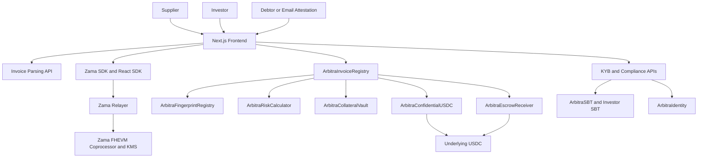
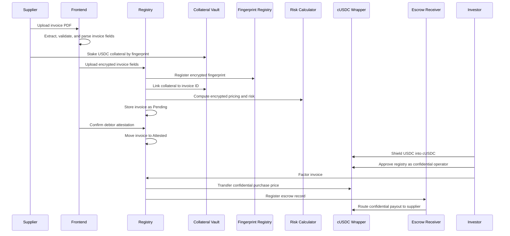

# Arbitra

Confidential invoice factoring on Ethereum Sepolia using Zama FHEVM, ERC-7984 confidential tokens, deterministic invoice ingestion, KYB-gated onboarding, and a Next.js application for suppliers, investors, and debtors.

## Table of Contents

- [Overview](#overview)
- [Problem Statement](#problem-statement)
- [Solution](#solution)
- [Key Features](#key-features)
- [Architecture Overview](#architecture-overview)
- [Technology Stack](#technology-stack)
- [Repository Structure](#repository-structure)
- [Prerequisites](#prerequisites)
- [Installation](#installation)
- [Environment Variables](#environment-variables)
- [Local Development Setup](#local-development-setup)
- [Workflow Explanation](#workflow-explanation)
- [Cryptography and Privacy Model](#cryptography-and-privacy-model)
- [Coding Standards](#coding-standards)
- [License](#license)
- [Frequently Asked Questions](#frequently-asked-questions)

## Overview

Arbitra is a confidential trade finance application for invoice factoring. Suppliers upload invoices, stake collateral, verify debtor details, and make receivables available to investors. Investors review encrypted invoice metadata and fund eligible invoices using confidential USDC flows. Debtors or platform-verified channels can attest and settle invoices at maturity.

The repository combines:

- Solidity smart contracts for invoice lifecycle management, risk scoring, identity, collateral, escrow, and confidential USDC.
- Zama FHEVM v0.11 encrypted computation for confidential invoice values, due dates, risk fields, compliance records, and wallet balances.
- ERC-7984 confidential token flows for cUSDC shielding, unshielding, operator approvals, and confidential transfers.
- A Next.js frontend for registration, dashboard views, invoice upload, marketplace review, portfolio tracking, and verification links.
- Deterministic invoice ingestion based on PDF extraction, OCR fallback, validation, and rule-based parsing.

## Problem Statement

Traditional invoice factoring requires suppliers to reveal sensitive commercial information such as invoice face values, debtor relationships, payment terms, discount rates, counterparty risk, and repayment history. Public blockchains make this harder because transactions and contract state are transparent by default.

A production-grade decentralized factoring flow must balance several requirements:

| Requirement | Challenge |
|---|---|
| Confidential financial data | Invoice values and underwriting values should not be publicly readable. |
| Investor verification | Investors need enough information to assess risk and fund receivables. |
| Debtor participation | Debtors may need a non-wallet email attestation path. |
| Stablecoin settlement | Funding and repayment should use familiar USDC-denominated flows. |
| Compliance controls | Suppliers and investors should be gated by KYB or identity attestations. |
| Auditability | State transitions, attestations, collateral, and settlements must remain verifiable. |

## Solution

Arbitra uses FHEVM encrypted handles and access-control lists to keep sensitive fields private while still allowing smart contracts to compute over them. Invoice lifecycle state remains public where needed, while values such as face value, due date, purchase price, discount rate, fingerprint, risk score, and compliance attributes are represented as encrypted handles.

The factoring flow combines plaintext and encrypted components:

- Plaintext fields support interoperability with USDC settlement, frontend indexing, and lifecycle status.
- Encrypted fields support confidential underwriting, risk scoring, invoice metadata, and wallet balances.
- ERC-7984 cUSDC provides confidential transfer semantics for investor funding and supplier settlement.
- Soulbound tokens and EIP-712 attestations gate access for suppliers and investors.
- The frontend coordinates encryption, decryption authorization, invoice ingestion, wallet actions, and contract calls.

## Key Features

### Confidential Invoice Registry

`ArbitraInvoiceRegistry` is the main orchestration contract. It stores invoice lifecycle state, encrypted invoice fields, supplier and investor associations, debtor attestations, collateral status, and settlement transitions.

The registry receives encrypted inputs from the frontend using FHEVM external input proofs. It coordinates with the fingerprint registry, risk calculator, collateral vault, escrow receiver, identity contracts, and cUSDC wrapper.

### Deterministic Invoice Ingestion

The frontend contains a deterministic invoice ingestion pipeline under `frontend/src/lib/ingestion`. It extracts text from PDF files, validates the extraction, optionally falls back to OCR, parses invoice fields through deterministic rules, and returns a structured draft.

The ingestion tests assert that the financial-core parsing path does not depend on Gemini or another LLM. This makes invoice extraction reproducible and easier to test.

### Confidential USDC Wrapper

`ArbitraConfidentialUSDC` wraps standard USDC as an ERC-7984 confidential token. Investors can shield USDC into cUSDC, approve the registry as an operator, and fund invoices through confidential transfers.

The deployment script `deploy/09_deploy_cusdc.ts` attempts to resolve an existing Sepolia confidential wrapper through the Zama wrappers registry. If no wrapper is found, it deploys `ArbitraConfidentialUSDC` and wires it into the registry and escrow receiver.

### KYB-Gated Onboarding

The onboarding flow uses non-transferable soulbound tokens to represent verification status. `MockKYBOracle` validates EIP-712 KYB attestations signed by a trusted backend signer and mints `ArbitraSBT` tokens. The identity contract stores encrypted compliance attributes for verified wallets.

The repository includes separate supplier and investor SBT flows.

### Collateral and Settlement

`ArbitraCollateralVault` requires suppliers to stake USDC collateral against invoice fingerprints before registration. The vault can release collateral on successful settlement or slash collateral when fraud is confirmed.

`ArbitraEscrowReceiver` records escrow metadata, handles settlement proofs, tracks signed payment references, and credits confidential settlement balances.

### Risk Scoring and Underwriting

`ArbitraRiskCalculator` computes encrypted discount rates, purchase prices, and risk bands with FHE arithmetic. The frontend also includes a deterministic API risk summary for investor-facing analysis.

### Frontend Application

The Next.js application includes routes and components for:

- Landing and onboarding
- Wallet connection
- Supplier registration
- Invoice upload
- Dashboard
- Marketplace
- Portfolio
- Debtor verification links
- Confidential wallet actions

The frontend uses Wagmi, Viem, Web3Auth, Zama SDK, Zama React SDK, Tailwind CSS, and Next.js API routes.

## Architecture Overview



### Contract Interaction Flow



## Technology Stack

| Layer | Technology |
|---|---|
| Smart contracts | Solidity `^0.8.27`, Hardhat 2, hardhat-deploy |
| FHE | Zama FHEVM v0.11, `@fhevm/solidity`, `@fhevm/hardhat-plugin`, `@fhevm/mock-utils` |
| Confidential tokens | OpenZeppelin Confidential Contracts, ERC-7984, `@zama-fhe/sdk`, `@zama-fhe/react-sdk` |
| Stablecoin | USDC on Sepolia, local `MockUSDC` for tests |
| Frontend | Next.js 14, React 18, TypeScript |
| Wallets | Wagmi, Viem, Ethers v6, Web3Auth |
| Styling | Tailwind CSS, Framer Motion, Recharts, Lucide React |
| APIs | Next.js route handlers |
| Storage | Upstash Redis when configured, local filesystem fallback for PDF cache |
| Parsing | PDF extraction, OCR fallback through Tesseract, deterministic parser |
| Testing | Hardhat, Chai, FHEVM test utilities |

## Repository Structure

```text
arbitra/
├── contracts/
│   ├── ArbitraInvoiceRegistry.sol
│   ├── ArbitraRiskCalculator.sol
│   ├── ArbitraFingerprintRegistry.sol
│   ├── ArbitraCollateralVault.sol
│   ├── ArbitraEscrowReceiver.sol
│   ├── ArbitraConfidentialUSDC.sol
│   ├── ArbitraIdentity.sol
│   ├── ArbitraSBT.sol
│   ├── MockKYBOracle.sol
│   ├── interfaces/
│   └── mocks/
├── deploy/
│   ├── 00_deploy_registry.ts
│   ├── 05_deploy_sbt.ts
│   ├── 06_deploy_kyb_oracle.ts
│   ├── 07_deploy_identity.ts
│   ├── 08_deploy_investor_sbt.ts
│   └── 09_deploy_cusdc.ts
├── frontend/
│   ├── src/app/
│   ├── src/components/
│   ├── src/hooks/
│   ├── src/lib/
│   ├── src/providers/
│   └── src/styles/
├── scripts/
├── test/
├── audit-artifacts/
├── docs/
├── hardhat.config.ts
├── package.json
├── package-lock.json
├── tsconfig.json
├── vercel.json
└── .env.example
```

| Path | Purpose |
|---|---|
| `contracts/` | Solidity contracts, interfaces, and local mocks. |
| `deploy/` | Hardhat deployment scripts and inter-contract wiring. |
| `frontend/src/app/` | Next.js pages and API route handlers. |
| `frontend/src/components/` | UI components for onboarding, invoice upload, marketplace, portfolio, and shared layout. |
| `frontend/src/hooks/` | React hooks for registry calls, invoice decryption, wallet state, and responsive UI. |
| `frontend/src/lib/` | Contract ABIs, address configuration, Zama SDK helpers, invoice ingestion, email, token, and PDF utilities. |
| `frontend/src/providers/` | Web3Auth, Wagmi, and Zama provider setup. |
| `scripts/` | Operational scripts for live checks, remediation, contract inspection, and environment updates. |
| `test/` | Hardhat contract tests and deterministic ingestion tests. |
| `audit-artifacts/` | Prior audit notes, UX captures, and demo evidence. |
| `docs/` | Supporting project documentation and audit reports. |

## Prerequisites

Install the following before running the project:

| Tool | Required Version | Notes |
|---|---:|---|
| Node.js | 22 or newer recommended | Required by the newer Zama SDK family. |
| npm | 10 or newer recommended | Lockfiles are npm-based. |
| Git | Current stable | Required for cloning and contribution workflow. |
| Sepolia ETH | Required for testnet deployment | Used for gas. |
| Sepolia USDC | Required for live factoring flows | Official Sepolia USDC is used by deployment scripts. |
| WalletConnect project ID | Optional for some wallet flows | Required when enabling WalletConnect in production. |
| Web3Auth client ID | Optional for embedded wallet flow | Required for Web3Auth login. |
| Vercel account | Optional | Used by the current deployment configuration. |

## Installation

Clone the repository and install the root dependencies:

```bash
git clone https://github.com/<ORG_OR_USER>/arbitra.git
cd arbitra
npm install
```

Install frontend dependencies:

```bash
cd frontend
npm install
cd ..
```

The repository pins `@zama-fhe/relayer-sdk` to `0.4.1` through `overrides`. This pin is important for compatibility with the FHEVM Hardhat plugin and mock utilities.

## Environment Variables

Create a local environment file from the example:

```bash
cp .env.example .env.local
```

For the frontend, either reuse the root `.env.local` through the deployment scripts or create a dedicated frontend file:

```bash
cp .env.example frontend/.env.local
```

### `.env.example`

```bash
# Deployer
DEPLOYER_PRIVATE_KEY=0x0000000000000000000000000000000000000000000000000000000000000000

# RPC
ALCHEMY_API_KEY=your_alchemy_api_key_here
SEPOLIA_RPC_URL=https://eth-sepolia.g.alchemy.com/v2/your_key
NEXT_PUBLIC_ALCHEMY_RPC_URL=https://eth-sepolia.g.alchemy.com/v2/your_key
NEXT_PUBLIC_SEPOLIA_RPC_URL=https://eth-sepolia.g.alchemy.com/v2/your_key
NEXT_PUBLIC_ZAMA_RELAYER_URL=https://relayer.testnet.zama.org/v2

# Network
NEXT_PUBLIC_USE_ENV_CONTRACT_ADDRESSES=true
NEXT_PUBLIC_CHAIN_ID=11155111
WRAPPERS_REGISTRY_ADDRESS=0x2f0750Bbb0A246059d80e94c454586a7F27a128e

# Token configuration
NEXT_PUBLIC_USDC_ADDRESS=0x1c7D4B196Cb0C7B01d743Fbc6116a902379C7238
NEXT_PUBLIC_CUSDC_ADDRESS=0x0000000000000000000000000000000000000000

# Contract addresses
NEXT_PUBLIC_REGISTRY_ADDRESS=0x0000000000000000000000000000000000000000
NEXT_PUBLIC_ESCROW_RECEIVER_ADDRESS=0x0000000000000000000000000000000000000000
NEXT_PUBLIC_COLLATERAL_VAULT_ADDRESS=0x0000000000000000000000000000000000000000
NEXT_PUBLIC_FINGERPRINT_REGISTRY_ADDRESS=0x0000000000000000000000000000000000000000
NEXT_PUBLIC_RISK_CALC_ADDRESS=0x0000000000000000000000000000000000000000
NEXT_PUBLIC_IDENTITY_ADDRESS=0x0000000000000000000000000000000000000000
NEXT_PUBLIC_SBT_ADDRESS=0x0000000000000000000000000000000000000000
NEXT_PUBLIC_INVESTOR_SBT_ADDRESS=0x0000000000000000000000000000000000000000
NEXT_PUBLIC_KYB_ORACLE_ADDRESS=0x0000000000000000000000000000000000000000
NEXT_PUBLIC_INVESTOR_KYB_ORACLE_ADDRESS=0x0000000000000000000000000000000000000000

# Frontend
NEXT_PUBLIC_APP_URL=https://arbitra-dapp.vercel.app
NEXT_PUBLIC_WALLETCONNECT_PROJECT_ID=your_walletconnect_project_id
NEXT_PUBLIC_WEB3AUTH_CLIENT_ID=your_web3auth_client_id

# Backend services
PLATFORM_VERIFIER_ADDRESS=0xyour_platform_verifier_address
VERIFIER_PRIVATE_KEY=0xyour_verifier_private_key
ORACLE_BACKEND_ADDRESS=0xyour_oracle_backend_address
COMPLIANCE_RELAYER_ADDRESS=0xyour_compliance_relayer_address
RESEND_API_KEY=your_resend_api_key
RESEND_FROM_EMAIL=onboarding@example.com

# Optional persistence
KV_REST_API_URL=your_upstash_redis_rest_url
KV_REST_API_TOKEN=your_upstash_redis_rest_token

# Optional explorer verification
ETHERSCAN_API_KEY=your_etherscan_api_key
```

## Local Development Setup

Compile the contracts:

```bash
npm run compile
```

Run the local contract tests:

```bash
npm test
```

Start the frontend:

```bash
npm run dev
```

The application runs at:

```text
http://localhost:3000
```

If frontend dependencies are not installed yet:

```bash
cd frontend
npm install
npm run dev
```

## Build Instructions

Build the frontend through the root package script:

```bash
npm run build
```

Build only the frontend:

```bash
cd frontend
npm run build
```

Compile only the Solidity contracts:

```bash
npm run compile
```

Run the FHE anti-pattern linter:

```bash
npm run lint:fhe
```

## Running the Application

Start the development server:

```bash
npm run dev
```

Open:

```text
http://localhost:3000
```

The app expects Sepolia by default. Wallets should be connected to chain ID `11155111`.

Core pages include:

| Route | Purpose |
|---|---|
| `/` | Landing and entry point. |
| `/register` | Supplier or investor onboarding. |
| `/dashboard` | Role-specific dashboard. |
| `/upload` | Supplier invoice upload. |
| `/marketplace` | Investor marketplace. |
| `/portfolio` | Supplier or investor portfolio view. |
| `/verify/[invoiceId]` | Debtor invoice verification flow. |

## Testing

Run all Hardhat tests:

```bash
npm test
```

Run a specific test file:

```bash
npx hardhat test test/ArbitraV2.test.ts
```

Run deterministic ingestion tests:

```bash
npx hardhat test test/InvoiceIngestion.test.ts
```

Run FHE lint checks:

```bash
npm run lint:fhe
```

Important test coverage includes:

| Test File | Coverage Area |
|---|---|
| `test/ArbitraV2.test.ts` | End-to-end invoice lifecycle, collateral, risk, factoring, and dispute behavior. |
| `test/ArbitraOnboarding.test.ts` | KYB attestation, SBT minting, replay safety, and encrypted compliance storage. |
| `test/ArbitraConfidentialUSDC.test.ts` | cUSDC wrapper behavior and operator configuration. |
| `test/ConfidentialWalletStateFrontend.test.ts` | Frontend confidential wallet state, empty ciphertext handling, and wrapper validation. |
| `test/InvoiceIngestion.test.ts` | Deterministic invoice extraction, OCR fallback, and parser stability. |

## Deployment

### Local Hardhat Deployment

```bash
npm run deploy:local
```

This deploys local mocks where appropriate and wires the local protocol stack.

### Sepolia Deployment

Configure `.env.local` with a funded deployer key, RPC endpoint, platform verifier, and oracle backend signer.

Deploy the core protocol:

```bash
npm run deploy:sepolia
```

Deploy a specific tag:

```bash
npx hardhat deploy --network sepolia --tags ArbitraInvoiceRegistry
npx hardhat deploy --network sepolia --tags ArbitraSBT
npx hardhat deploy --network sepolia --tags MockKYBOracle
npx hardhat deploy --network sepolia --tags ArbitraIdentity
npx hardhat deploy --network sepolia --tags ArbitraInvestorSBT
npx hardhat deploy --network sepolia --tags ArbitraConfidentialUSDC
```

The cUSDC deployment script resolves or deploys a wrapper and prints:

```bash
NEXT_PUBLIC_CUSDC_ADDRESS=<resolved_or_deployed_wrapper>
```

Copy deployed addresses into `.env.local` and the frontend hosting environment.

### Vercel Deployment

The repository includes `vercel.json` and Next.js headers required for FHE SDK browser support.

```bash
cd frontend
npm run build
```

For Vercel, configure the same environment variables in the Vercel dashboard. Production deployments must not expose private keys through `NEXT_PUBLIC_*` variables.

## Usage Guide

### Supplier Flow

1. Register or connect a wallet.
2. Complete KYB verification and receive a non-transferable SBT.
3. Upload an invoice PDF.
4. Review parsed invoice fields.
5. Stake USDC collateral against the invoice fingerprint.
6. Encrypt invoice values in the browser.
7. Submit the invoice to the registry.
8. Share the debtor verification link or use the platform attestation path.
9. Wait for investor factoring.
10. Receive confidential cUSDC proceeds when the invoice is funded.

### Investor Flow

1. Register or connect a wallet.
2. Complete investor onboarding and receive an investor SBT.
3. Shield Sepolia USDC into cUSDC.
4. Grant a Zama decryption permit when viewing confidential balances.
5. Approve the registry as a cUSDC operator.
6. Review marketplace invoices.
7. Request access to encrypted underwriting fields where permitted.
8. Factor an eligible invoice.
9. Track funded invoices in the portfolio view.

### Debtor Flow

1. Open the verification link.
2. Review the invoice information presented by the app.
3. Submit email-based attestation.
4. At maturity, repay or participate in the configured settlement path.

## Workflow Explanation

The application works from ingestion through settlement as follows:

1. The supplier uploads a PDF invoice.
2. The frontend extracts text, validates completeness, and falls back to OCR when native PDF extraction is insufficient.
3. The deterministic parser produces an invoice draft with invoice number, supplier, debtor, email, face value, due date, and line-item hints.
4. The supplier stakes USDC collateral in `ArbitraCollateralVault`.
5. The frontend encrypts confidential values with the Zama SDK and submits encrypted handles plus input proofs to `ArbitraInvoiceRegistry`.
6. The registry stores invoice metadata, registers the encrypted fingerprint, links collateral, and computes encrypted pricing and risk values.
7. The debtor confirms the invoice through wallet or email-based platform attestation.
8. Investors shield USDC into cUSDC through the ERC-7984 wrapper.
9. Investors grant operator rights to the registry and factor an attested invoice.
10. The registry transfers confidential purchase-price value through cUSDC and registers escrow.
11. The escrow receiver tracks maturity and signed repayment proofs.
12. Settlement releases collateral, updates supplier repayment statistics, and moves the invoice into its terminal state.

## API Documentation

The frontend exposes Next.js API routes under `frontend/src/app/api`.

| Endpoint | Method | Purpose |
|---|---|---|
| `/api/parse-invoice` | `POST` | Parses uploaded invoice files and returns a deterministic invoice draft. |
| `/api/risk-assessment` | `POST` | Returns a deterministic investor risk summary. |
| `/api/send-verify-email` | `POST` | Sends debtor verification links. |
| `/api/verify-token` | `POST` | Validates debtor verification tokens. |
| `/api/attest-email` | `POST` | Submits platform-signed debtor email attestations. |
| `/api/kyb-verify` | `POST` | Runs mock KYB verification and prepares attestation data. |
| `/api/kyb-mint` | `POST` | Submits KYB attestation transactions for SBT minting. |
| `/api/kyb-health` | `GET` | Checks verifier-key configuration. |
| `/api/compliance-store` | `POST` | Relays encrypted compliance storage to `ArbitraIdentity`. |
| `/api/mock-bank-webhook` | `POST` | Simulates bank payment proof submission for settlement. |
| `/api/download-invoice` | `GET` | Retrieves cached invoice PDFs. |
| `/api/download-noa` | `GET` | Generates notice-of-assignment documents. |
| `/api/clear-onboarding` | `POST` | Clears local onboarding state for development or test flows. |

Example invoice parsing request:

```bash
curl -X POST http://localhost:3000/api/parse-invoice \
  -F "invoice=@./sample-invoice.pdf"
```

Example risk assessment request:

```bash
curl -X POST http://localhost:3000/api/risk-assessment \
  -H "Content-Type: application/json" \
  -d '{
    "invoiceId": 1,
    "supplierAddress": "0x0000000000000000000000000000000000000001",
    "buyerAddress": "0x0000000000000000000000000000000000000002",
    "uploadTimestamp": 1710000000,
    "isFactored": false,
    "isRepaid": false
  }'
```

Request and response schemas should be finalized before publishing a stable public API.

## Smart Contract Documentation

| Contract | Purpose |
|---|---|
| `ArbitraInvoiceRegistry` | Main invoice lifecycle orchestrator. Stores invoice state, encrypted handles, attestations, supplier history, cUSDC factoring, and settlement transitions. |
| `ArbitraRiskCalculator` | Computes encrypted discount, purchase price, risk score, and risk band using FHE operations. |
| `ArbitraFingerprintRegistry` | Stores encrypted invoice fingerprints and supports homomorphic duplicate checks. |
| `ArbitraCollateralVault` | Manages supplier USDC collateral staking, linking, release, and slashing. |
| `ArbitraEscrowReceiver` | Tracks escrow records, repayment proofs, settlement finalization, disputes, and confidential settlement balances. |
| `ArbitraConfidentialUSDC` | ERC-7984 confidential wrapper over standard USDC. |
| `ArbitraIdentity` | Stores encrypted compliance attributes for verified wallets. |
| `ArbitraSBT` | Non-transferable supplier verification token. |
| `MockKYBOracle` | EIP-712 KYB attestation verifier used by the current onboarding flow. |
| `MockUSDC` | Local ERC-20 mock for tests. |
| `MockERC7984` | Local confidential token mock for tests. |

### Key Contract States

`ArbitraInvoiceRegistry.InvoiceStatus`:

| Value | State | Meaning |
|---:|---|---|
| `0` | `Pending` | Invoice uploaded but not attested. |
| `1` | `Attested` | Debtor or platform attestation has been accepted. |
| `2` | `Factored` | Investor has funded the invoice. |
| `3` | `Settled` | Maturity settlement has completed. |
| `4` | `Disputed` | Invoice is under dispute. |
| `5` | `Slashed` | Fraud was confirmed and collateral was slashed. |

`ArbitraCollateralVault.StakeState`:

| State | Meaning |
|---|---|
| `UNSTAKED` | No collateral is associated with the key. |
| `STAKED_PENDING_REGISTRATION` | Supplier has staked collateral by invoice fingerprint. |
| `REGISTERED` | Collateral has been linked to an invoice ID. |
| `FINANCED` | Invoice has been factored. |
| `REPAID` | Settlement repayment is recorded. |
| `STAKE_RELEASED` | Supplier collateral has been returned. |
| `SLASHED` | Collateral has been redirected due to confirmed fraud. |

## Cryptography and Privacy Model

### FHEVM Handles

FHEVM contracts operate on encrypted handles rather than plaintext values. The off-chain FHE coprocessor performs encrypted computation, and contracts store or pass handles that represent encrypted values.

### Encrypted Inputs

The frontend encrypts user inputs and submits:

- An `externalEuint*` handle
- A matching input proof
- The contract and user context used during encryption

Contracts ingest these values with `FHE.fromExternal`.

### Access Control Lists

Each encrypted handle has an ACL. Contracts must explicitly grant:

- Contract access with `FHE.allowThis`
- User access with `FHE.allow(value, user)`
- Token or downstream contract access where a confidential transfer needs it

### User Decryption

Users decrypt only handles for which they have ACL permission. The frontend uses Zama SDK permit and balance hooks for cUSDC, and custom decryption helpers for non-token handles.

### Public Data

Not all protocol data is private. Addresses, invoice IDs, lifecycle statuses, event timestamps, contract wiring, and some settlement metadata are public. Some plaintext amounts are retained where standard USDC settlement or frontend indexing requires them.

### Confidential Data

The following data is represented with encrypted handles in the current contract design:

- Invoice face value
- Due date
- Purchase price
- Discount rate
- Risk score
- Risk band
- Invoice fingerprint
- Supplier repayment statistics
- Compliance tax ID encoding
- KYB status
- Compliance risk score
- cUSDC balances and confidential transfers

## Error Handling

### Frontend Error Handling

The frontend maps Zama SDK and wallet errors into user-facing states. Notably, `NoCiphertextError` is treated as an empty confidential-wallet state rather than a zero balance.

API routes validate request bodies, verifier key configuration, signer mismatches, wallet addresses, and required contract addresses. Errors are returned as JSON with appropriate HTTP status codes.

### Contract Error Handling

Contracts use `require` checks for authorization, zero-address validation, invalid lifecycle transitions, duplicate collateral or fingerprint registration, and signature validation.

FHE-specific errors can come from the FHEVM host contracts when ACL, input proof, decryption proof, or unsupported-operation assumptions are violated.

### Operational Error Handling

Deployment scripts validate wrapper configuration, contract wiring, and required environment variables. Scripts should be run from a clean environment with explicit deployment keys and verified RPC access.

## Configuration

### Hardhat

The root `hardhat.config.ts` uses:

| Setting | Value |
|---|---|
| Solidity | `0.8.27` |
| Optimizer | Enabled, 200 runs |
| EVM version | `cancun` |
| `viaIR` | Enabled |
| Hardhat chain ID | `31337` |
| Sepolia chain ID | `11155111` |
| FHEVM network | `sepolia` |

### Next.js

The frontend config enables:

- React strict mode
- WebAssembly support for Zama SDK dependencies
- Node.js fallbacks disabled for browser bundles
- COOP and COEP headers
- File tracing for FHE and PDF/OCR assets

## Coding Standards

The project uses strict FHEVM coding standards documented in `AGENTS.md` and `.agents/skills/fhevm-skill`.

Key standards include:

- Solidity and TypeScript source files use block comments for generated or maintained code in the FHEVM style.
- Solidity contracts include file headers, NatSpec, and section dividers.
- FHEVM contracts use `ZamaEthereumConfig`.
- User-submitted encrypted inputs are ingested with `FHE.fromExternal`.
- Stored encrypted computations call `FHE.allowThis`.
- User-readable encrypted values receive `FHE.allow`.
- Encrypted branching uses `FHE.select`.
- Deprecated FHEVM patterns such as `TFHE`, `SepoliaConfig` as a Solidity base, `FHE.requestDecryption`, and `FHE.neq` are not used.
- The FHE linter should pass before delivery:

```bash
npm run lint:fhe
```

## License

The existing repository README identifies the project as MIT licensed. Before publishing the repository publicly, maintainers should add a root `LICENSE` file containing the full MIT License text or update this section to match the chosen license.

## Acknowledgements

Arbitra builds on open-source infrastructure and standards from:

- Zama FHEVM
- OpenZeppelin Contracts and OpenZeppelin Confidential Contracts
- Ethereum, Sepolia, and the Solidity ecosystem
- Hardhat and hardhat-deploy
- Next.js, React, Wagmi, Viem, and Ethers
- Tesseract OCR and the PDF parsing ecosystem
- Circle USDC testnet infrastructure

## References

- [Zama Protocol Documentation](https://docs.zama.org/protocol)
- [Zama FHEVM Solidity Guides](https://docs.zama.org/protocol/solidity-guides)
- [Zama JavaScript SDK Documentation](https://docs.zama.org/protocol/sdk)
- [OpenZeppelin Confidential Contracts](https://docs.openzeppelin.com/confidential-contracts)
- [OpenZeppelin Contracts](https://docs.openzeppelin.com/contracts)
- [Hardhat Documentation](https://hardhat.org/docs)
- [Next.js Documentation](https://nextjs.org/docs)
- [Wagmi Documentation](https://wagmi.sh)
- [Viem Documentation](https://viem.sh)

## Frequently Asked Questions

### Is Arbitra deployed to mainnet?

The repository is configured around Sepolia. Mainnet deployment requires project-specific customization, production governance, a security audit, production KYB integrations, and final verification of FHEVM and cUSDC infrastructure.

### Does the application store invoice values publicly?

Some lifecycle and interoperability fields are public, but core financial and underwriting values are represented as encrypted FHE handles. The exact public/private boundary should be reviewed before production use.

### Why does the app need COOP and COEP headers?

The Zama browser SDK uses WebAssembly and SharedArrayBuffer. Cross-origin isolation headers are required for that runtime environment.

### Why is `@zama-fhe/relayer-sdk` pinned to `0.4.1`?

The FHEVM Hardhat toolchain and mock utilities expect this version. The root and frontend packages use an override to keep dependency resolution stable.

### Can any USDC token be used as cUSDC?

No. The configured cUSDC wrapper must wrap the intended USDC contract and use the expected decimals. On Sepolia, the deployment script resolves or deploys a wrapper for the official Sepolia USDC address.

### Is the KYB oracle production-ready?

The current `MockKYBOracle` implements EIP-712 signature verification and replay protection for the repository flow, but production use requires a real KYB provider, operational controls, key management, and compliance review.

### Does the project use a traditional database?

No relational schema is defined. Canonical protocol state lives on-chain. Redis is optional for cached PDF storage, and browser IndexedDB stores Zama SDK permit/session data.

### What should be customized before public release?

At minimum, maintainers should add a root license file, audit environment files, replace or document deployment addresses, finalize API schemas, add CI, and document production governance.
