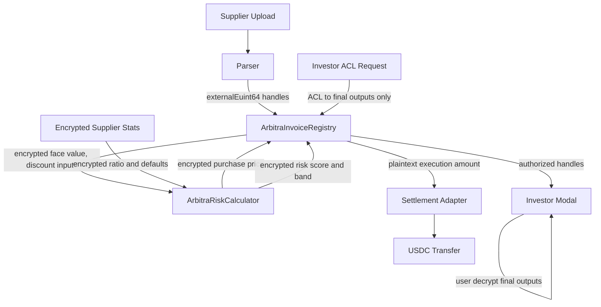

# Confidential Protocol Architecture Refactor

Date: 2026-07-01
Branch: codex/confidentiality-refactor-final

## What Changed

Arbitra now has a real confidential underwriting path in the protocol domain.

- `ArbitraRiskCalculator.calculateConfidentialRiskScore` computes encrypted `riskScore` and encrypted `riskBand`.
- `ArbitraInvoiceRegistry` stores encrypted underwriting output on each invoice.
- Supplier stats now include encrypted `defaultedInvoices`.
- Confirmed fraud/default increments encrypted default history.
- `requestRiskAssessmentAccess` grants investors access to final invoice terms and final underwriting output only.
- Investors no longer receive raw encrypted repayment ratio or default count through the access flow.
- The investor modal no longer runs local deterministic risk analysis for the decision UI.
- Marketplace cards no longer call operational status a risk band.
- The landing page now explains the confidential lifecycle and why each primitive is used.

## Why This Improves Confidentiality

The prior architecture encrypted invoice terms but still let underwriting happen outside the confidential domain. That weakened the product story because investors could see a local score derived after decrypted raw terms entered frontend state.

The new architecture is:

```text
Encrypted repayment history
+ encrypted invoice value
+ encrypted due date / tenor signal
+ encrypted supplier reputation
+ encrypted historical defaults
        |
        v
FHE computes encrypted risk score and risk band
        |
        v
Investor requests ACL access
        |
        v
Only final score, band, and authorized terms are decrypted
```

This is a stronger Zama story because the commercially sensitive inputs remain confidential while the protocol still produces a useful underwriting decision.

## Dependency Graph



## Remaining Plaintext Business Values

| Field | Why It Still Exists | Integration Boundary? | Future Direction |
| --- | --- | --- | --- |
| `faceValuePlaintext` | Standard ERC-20 collateral and repayment flows require a clear transfer/check amount. | Yes | Replace with confidential token rails or proof-bound settlement adapter. |
| `discountRatePlaintext` | Existing USDC purchase flow computes clear transfer amount from a boundary approximation. | Yes | Derive at authorized execution boundary from KMS/public-decrypt proof. |
| Plaintext purchase price | ERC-20 `transferFrom` requires clear amount. | Yes | Use confidential ERC-20 or authorized adapter with attestable decryption. |
| Mock bank amount | Demo payment rail reconciles clear off-chain payment amount. | Yes | Store only commitments on-chain and confine clear value to bank adapter logs. |
| NOA legal values | Legal documents must disclose assigned invoice terms to named parties. | Yes | Encrypt documents at rest and restrict download authorization. |
| Invoice status | Needed for public coordination and marketplace workflow. | No | Keep plaintext. |
| Debtor email hash | Commitment supports email attestation without raw email. | No | Keep as hash commitment. |
| Payment reference and bank trace commitments | Auditability without revealing bank metadata. | No | Keep as commitments. |

## Updated Confidentiality Matrix

| Business Field | Current Primitive | Classification | Reason |
| --- | --- | --- | --- |
| Invoice face value | FHE plus boundary plaintext | Uses FHE correctly, boundary remains | Confidential pricing and underwriting need computation; ERC-20 execution still needs clear amount. |
| Due date / tenor | FHE | Uses FHE correctly | Used in pricing and underwriting without public disclosure. |
| Purchase price | FHE plus boundary plaintext | Uses FHE correctly, boundary remains | Confidential economics are computed on-chain; standard USDC transfer leaks execution amount. |
| Discount rate | FHE plus boundary plaintext | Uses FHE correctly, boundary remains | Pricing model is sensitive; boundary approximation remains for current transfer path. |
| Risk score | FHE | Uses FHE correctly | Final output is computed from private inputs and selectively decrypted. |
| Risk band | FHE | Uses FHE correctly | No public pre-ACL band is shown in marketplace. |
| Repayment ratio | FHE | Uses FHE correctly | Raw supplier history should not be visible to investors. |
| Historical defaults | FHE | Uses FHE correctly | Defaults affect underwriting without exposing supplier history. |
| Supplier reputation multiplier | FHE | Uses FHE correctly | Private input to underwriting and discount. |
| Invoice fingerprint | FHE plus plaintext stake fingerprint | Should use commitments plus FHE duplicate logic | Current stake lookup still needs plaintext fingerprint; future migration should use commitment-first collateral linking. |
| Invoice PDF | Conventional encryption | Should use AES/storage encryption | Documents are stored and retrieved, not computed on homomorphically. |
| Payment reference | Hash commitment | Should use commitments | Integrity and audit trail matter more than arithmetic. |
| KYB approval | Signature plus encrypted compliance record | Correct mixed primitive | Authorization is signature-based; compliance attributes are FHE. |
| Invoice status | Plaintext | Should remain plaintext | Public workflow state coordinates participants. |
| Wallet roles / SBT status | Plaintext | Should remain plaintext | Access gating must be publicly verifiable. |

## Zama Hackathon Assessment

| Category | Score | Rationale |
| --- | ---: | --- |
| Confidential Computing | 8 | Underwriting now has a real FHE path. Boundary plaintext remains for standard ERC-20 execution. |
| Zama Integration | 8 | Uses external encrypted inputs, FHE arithmetic, ACL, `allowThis`, and selective user decrypt. |
| Product Quality | 8 | Investor flow now matches the confidential protocol story more closely. |
| User Experience | 7 | Selective disclosure is clearer, but live migration/deployment messaging is still needed. |
| Technical Depth | 8 | FHE pricing plus FHE underwriting is meaningful and practical. |
| Smart Contract Design | 7 | Additive design is stable, but v2 should remove public plaintext getters. |
| Security | 7 | ACLs are stronger; boundary plaintext and mock rails remain explicit risks. |
| Demo Quality | 8 | Landing page now explains the architecture and primitive choices. |
| Innovation | 8 | Confidential underwriting from private supplier history is the strongest differentiator. |
| Production Readiness | 6 | Needs migration, confidential token rail strategy, and encrypted document retention controls. |

## Recommended Next Steps

P0:
- Redeploy registry and risk calculator, then migrate active invoices or clearly mark legacy invoices as pre-underwriting-upgrade.
- Replace public economic getters in v2 ABI or restrict them to explicit boundary roles.

P1:
- Add KMS/public-decrypt proof path for ERC-20 execution amounts.
- Move collateral fingerprint linking from plaintext fingerprint to commitment-first linking.

P2:
- Encrypt invoice PDFs at rest with strict retention and access controls.
- Add a platform dashboard showing encrypted state, boundary state, and ACL grants.

P3:
- Explore confidential token rails for fully private settlement.
- Add investor portfolio analytics from encrypted or bucketed data.
